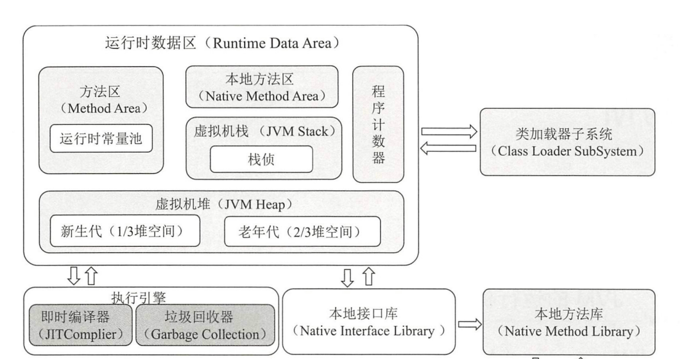
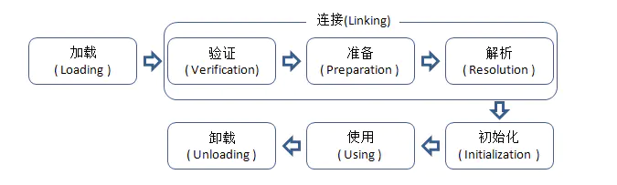
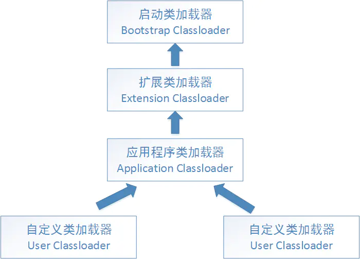
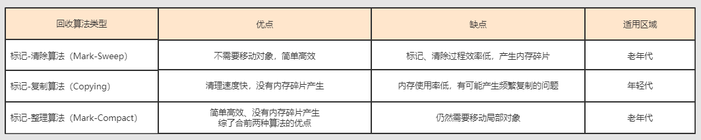

<h1>jvm</h1>

<h3>jvm的运行时内存模型</h3>

+ 程序计数器： 存储当前线程所执行的字节码的行号指示器，用于cpu时间片轮换，记录之前运行到哪一步了
+ 方法区：用于保存已被虚拟机加载的类信息(类的版本，字段，方法，接口和父类信息)，运行时常量信息（static，final修饰的常量和字符串常量信息）  
+ 本地方法栈：存放调用的native方法
+ 虚拟机栈：每个方法在执行的同时都会创建一个栈帧（Stack Frame）用于存储局部变量表、操作数栈、动态链接、方法出口等信息；
+ 堆：创建的对象和数组都保存在 Java 堆内存中，也是垃圾收集器进行垃圾收集的最重要的内存区域
+ 线程私有的虚拟机栈，本地方法栈和程序计数器，线程共享的有方法区和堆。

<h3>类加载过程</h3>

  将class文件放至内存中，通过对数据进行校验，转换，解析和初始化，形成可以被虚拟机使用的class类对象
+ 装载：将class文件中的信息读取到内存中
+ 链接
  + 验证：验证文件格式
  + 准备：为静态变量分配内存并设置默认的初始值
  + 解析：将符合引用转换为直接引用
+ 初始化：1)如果类存在直接的父类并且这个类还没有被初始化，那么就先初始化父类；2)如果类中存在初始化语句，就依次执行这些初始化语句（将类的静态变量赋予我们自己设置的初始化值）

<h3>类加载器</h3>

JVM的类加载的过程是通过引导类加载器（bootstrap classloader）创建一个初始类（initial class）来完成
+ 双亲委派模型
  + 1.在类加载的时候，系统会首先判断当前类是否被加载过。已经被加载的类会直接返回，否则才会尝试加载。
  + 2.加载的时候，首先会把该请求委派给该父类加载器的 loadClass() 处理，因此所有的请求最终都应该传送到顶层的启动类加载器 BootstrapClassLoader 中。
  + 3.当父类加载器无法处理时，才由自己来处理。
+ 类加载器（自顶向下）
  + bootstrap类加载器，加载/lib/rt.jar下的jar包
  + extension类加载器，加载/lib/*.jar下的jar包
  + application类加载器，加载classpath下的jar包 默认项目代码都会被打包到classpath下通过该类加载器加载。

<h3>判断一个对象是否可被回收</h3>

+ 引用计数法 给每一个对象设置一个引用计数器，当有一个地方引用该对象的时候，引用计数器就+1，引用失效时，引用计数器就-1；当引用计数器为0的时候，就说明这个对象没有被引用，也就是垃圾对象，等待回收； 缺点：无法解决循环引用的问题，当A引用B，B也引用A的时候，此时AB对象的引用都不为0，此时也就无法垃圾回收，所以一般主流虚拟机都不采用这个方法；
+ 可达性分析 从一个被称为GC Roots的对象向下搜索，如果一个对象到GC Roots没有任何引用链相连接时，说明此对象不可用，
  在java中可以作为GC Roots的对象有以下几种：
   + 虚拟机栈中引用的对象
   + 方法区类静态属性引用的变量
   + 方法区常量池引用的对象
   + 本地方法栈JNI引用的对象

<h3>强引用、软引用、弱引用、虚引用是什么，有什么区别？</h3>

+ 强引用: 就是普通的对象引用关系，如 String s = new String("123")  没有任何正常引用后会被GC回收
+ 软引用: 用于维护一些可有可无的对象。共用一块缓存，缓存不够用，新增后覆盖前面的，当在内存不足时，系统则会回收软引用对象;
+ 弱引用: 被弱引用关联的对象一定会被回收，也就是说它只能存活到下一次垃圾回收发生之前。
  ThreadLocal实现使用
+ 虚引用: 为一个对象设置虚引用的唯一目的是能在这个对象被回收时收到一个系统通知。 ZeroCopy,NIO实现使用

<h3>垃圾回收算法</h3>

+ 标记清除
  + 第一步：利用可达性去遍历内存，把存活对象和垃圾对象进行标记； 
  + 第二步：在遍历一遍，将所有标记的对象回收掉； 
  特点：效率不行，标记和清除的效率都不高；标记和清除后会产生大量的不连续的空间分片，可能会导致之后程序运行的时候需分配大对象而找不到连续分片而不得不触发一次GC；
+ 标记整理
  + 第一步：利用可达性去遍历内存，把存活对象和垃圾对象进行标记； 
  + 第二步：将所有的存活的对象向一段移动，将端边界以外的对象都回收掉； 
  特点：适用于存活对象多，垃圾少的情况；需要整理的过程，无空间碎片产生；
+ 复制算法
  + 将内存按照容量大小分为大小相等的两块，每次只使用一块，当一块使用完了，就将还存活的对象移到另一块上，然后在把使用过的内存空间移除； 
  特点：不会产生空间碎片；内存使用率极低；
+ 分代算法
  + 根据内存对象的存活周期不同，将内存划分成几块，java虚拟机一般将内存分成新生代和老生代，在新生代中，有大量对象死去和少量对象存活，所以采用复制算法，
  只需要付出少量存活对象的复制成本就可以完成收集；老年代中因为对象的存活率极高，没有额外的空间对他进行分配担保，所以采用标记清理或者标记整理算法进行回收；

对比: 

<h3>垃圾回收器</h3>

+ 垃圾回收器主要分为以下几种：Serial、ParNew、Parallel Scavenge、Serial Old、Parallel Old、CMS、G1
+ Serial:单线程的收集器，收集垃圾时，必须stop the world，使用复制算法。它的最大特点是在进行垃圾回收时，需要对所有正在执行的线程暂停（stop the world），对于有些应用是难以接受的，但是如果应用的实时性要求不是那么高，只要停顿的时间控制在N毫秒之内，大多数应用还是可以接受的，是client级别的默认GC方式。
+ ParNew:Serial收集器的多线程版本，也需要stop the world，复制算
+ Parallel Scavenge:新生代收集器，复制算法的收集器，并发的多线程收集器，目标是达到一个可控的吞吐量，和ParNew的最大区别是GC自动调节策略；虚拟机会根据系统的运行状态收集性能监控信息，动态设置这些参数，以提供最优停顿时间和最高的吞吐量；
+ Serial Old:Serial收集器的老年代版本，单线程收集器，使用标记整理算法。
+ Parallel Old：是Parallel Scavenge收集器的老年代版本，使用多线程，标记-整理算法。
+ CMS:是一种以获得最短回收停顿时间为目标的收集器，标记清除算法，运作过程：初始标记，并发标记，重新标记，并发清除，收集结束会产生大量空间碎片； 
+ G1:标记整理算法实现，运作流程主要包括以下：初始标记，并发标记，最终标记，筛选回收。不会产生空间碎片，可以精确地控制停顿；G1将整个堆分为大小相等的多个Region（区域），G1跟踪每个区域的垃圾大小，在后台维护一个优先级列表，每次根据允许的收集时间，优先回收价值最大的区域，已达到在有限时间内获取尽可能高的回收效率

<h3>CMS垃圾回收过程</h3>

<h3>G1垃圾回收过程</h3>

<h3>内存分配与回收策略</h3>

+ Minor GC：回收新生代，因为新生代对象存活时间很短，因此 Minor GC 会频繁执行，执行的速度一般也会比较快。
+ Full GC：回收老年代和新生代，老年代对象其存活时间长，因此 Full GC 很少执行，执行速度会比 Minor GC 慢很多
### 内存分配策略
#### 1. 对象优先在 Eden 分配
大多数情况下，对象在新生代 Eden 上分配，当 Eden 空间不够时，发起 Minor GC。

#### 2. 大对象直接进入老年代

+ 大对象是指需要连续内存空间的对象，最典型的大对象是那种很长的字符串以及数组。
经常出现大对象会提前触发垃圾收集以获取足够的连续空间分配给大对象。
-XX:PretenureSizeThreshold，大于此值的对象直接在老年代分配，避免在 Eden 和 Survivor 之间的大量内存复制。

#### 3. 长期存活的对象进入老年代

+ 为对象定义年龄计数器，对象在 Eden 出生并经过 Minor GC 依然存活，将移动到 Survivor 中，年龄就增加 1 岁，增加到一定年龄则移动到老年代中。
-XX:MaxTenuringThreshold 用来定义年龄的阈值。

#### 4. 动态对象年龄判定
+ 虚拟机并不是永远要求对象的年龄必须达到 MaxTenuringThreshold 才能晋升老年代，如果在 Survivor 中相同年龄所有对象大小的总和大于 Survivor 空间的一半，则年龄大于或等于该年龄的对象可以直接进入老年代，无需等到 MaxTenuringThreshold 中要求的年龄。

#### 5. 空间分配担保
在发生 Minor GC 之前，虚拟机先检查老年代最大可用的连续空间是否大于新生代所有对象总空间，如果条件成立的话，那么 Minor GC 可以确认是安全的。
如果不成立的话虚拟机会查看 HandlePromotionFailure 的值是否允许担保失败，如果允许那么就会继续检查老年代最大可用的连续空间是否大于历次晋升到老年代对象的平均大小，如果大于，将尝试着进行一次 Minor GC；如果小于，或者 HandlePromotionFailure 的值不允许冒险，那么就要进行一次 Full GC。

### Full GC 的触发条件
对于 Minor GC，其触发条件非常简单，当 Eden 空间满时，就将触发一次 Minor GC。而 Full GC 则相对复杂，有以下条件：
#### 1. 调用 System.gc()

+ 只是建议虚拟机执行 Full GC，但是虚拟机不一定真正去执行。不建议使用这种方式，而是让虚拟机管理内存。

#### 2. 老年代空间不足
+ 老年代空间不足的常见场景为前文所讲的大对象直接进入老年代、长期存活的对象进入老年代等。
为了避免以上原因引起的 Full GC，应当尽量不要创建过大的对象以及数组。除此之外，可以通过 -Xmn 虚拟机参数调大新生代的大小，让对象尽量在新生代被回收掉，不进入老年代。还可以通过 -XX:MaxTenuringThreshold 调大对象进入老年代的年龄，让对象在新生代多存活一段时间。

#### 3. 空间分配担保失败

+ 使用复制算法的 Minor GC 需要老年代的内存空间作担保，如果担保失败会执行一次 Full GC。具体内容请参考上面的第 5 小节。

#### 4. JDK 1.7 及以前的永久代空间不足

+ 在 JDK 1.7 及以前，HotSpot 虚拟机中的方法区是用永久代实现的，永久代中存放的为一些 Class 的信息、常量、静态变量等数据。
当系统中要加载的类、反射的类和调用的方法较多时，永久代可能会被占满，在未配置为采用 CMS GC 的情况下也会执行 Full GC。如果经过 Full GC 仍然回收不了，那么虚拟机会抛出 java.lang.OutOfMemoryError。
为避免以上原因引起的 Full GC，可采用的方法为增大永久代空间或转为使用 CMS GC。

#### 5. Concurrent Mode Failure

+ 执行 CMS GC 的过程中同时有对象要放入老年代，而此时老年代空间不足（可能是 GC 过程中浮动垃圾过多导致暂时性的空间不足），便会报 Concurrent Mode Failure 错误，并触发 Full GC

<h3>jvm调优命令</h3>

<h3></h3>
<h3></h3>
<h3></h3>

