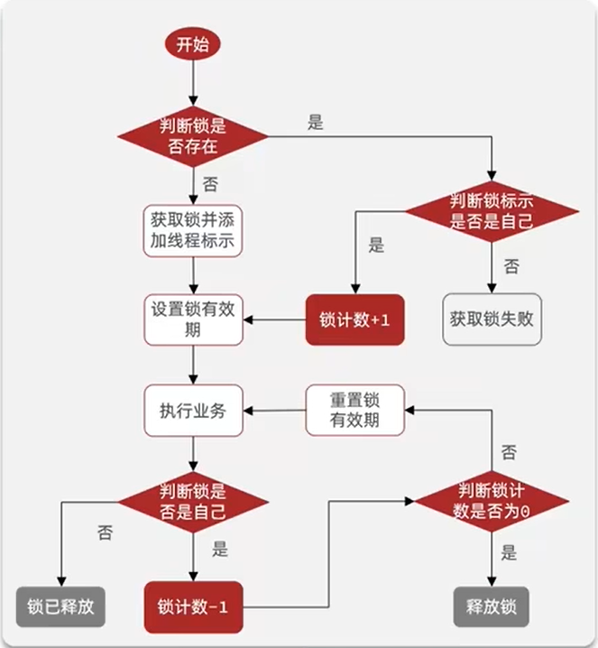

#redis

### redis的常用数据结构和使用场景
+ 1、String：String是最常用的一种数据类型，普通的key- value 存储都可以归为此类。其中Value既可以是数字也可以是字符串。使用场景：常规key-value缓存应用。常规计数: 微博数， 粉丝数。
```
> set hello world
OK
> get hello
"world"
> del hello
(integer) 1
> get hello
(nil)
```
+ 2、Hash：Hash 是一个键值(key => value)对集合。Redishash 是一个 string 类型的 field 和 value 的映射表，hash 特别适合用于存储对象，并且可以像数据库中update一个属性一样只修改某一项属性值。
```
> hset hash-key sub-key1 value1
(integer) 1
> hset hash-key sub-key2 value2
(integer) 1
> hset hash-key sub-key1 value1
(integer) 0

> hgetall hash-key
1) "sub-key1"
2) "value1"
3) "sub-key2"
4) "value2"

> hdel hash-key sub-key2
(integer) 1
> hdel hash-key sub-key2
(integer) 0

> hget hash-key sub-key1
"value1"

> hgetall hash-key
1) "sub-key1"
2) "value1"
```
+ 3、Set：Set是一个无序的天然去重的集合，即Key-Set。此外还提供了交集、并集等一系列直接操作集合的方法，对于求共同好友、共同关注什么的功能实现特别方便。
```
> sadd set-key item
(integer) 1
> sadd set-key item2
(integer) 1
> sadd set-key item3
(integer) 1
> sadd set-key item
(integer) 0

> smembers set-key
1) "item"
2) "item2"
3) "item3"

> sismember set-key item4
(integer) 0
> sismember set-key item
(integer) 1

> srem set-key item2
(integer) 1
> srem set-key item2
(integer) 0

> smembers set-key
1) "item"
2) "item3
```
+ 4、List：List是一个有序可重复的集合，其遵循FIFO的原则，底层是依赖双向链表实现的，因此支持正向、反向双重查找。通过List，我们可以很方面的获得类似于最新回复这类的功能实现。
```
> rpush list-key item
(integer) 1
> rpush list-key item2
(integer) 2
> rpush list-key item
(integer) 3

> lrange list-key 0 -1
1) "item"
2) "item2"
3) "item"

> lindex list-key 1
"item2"

> lpop list-key
"item"

> lrange list-key 0 -1
1) "item2"
2) "item"
```
+ 5、ZSet：类似于java中的TreeSet，是Set的可排序版。此外还支持优先级排序，维护了一个score的参数来实现。适用于排行榜和带权重的消息队列等场景。
```
> zadd zset-key 728 member1
(integer) 1
> zadd zset-key 982 member0
(integer) 1
> zadd zset-key 982 member0
(integer) 0

> zrange zset-key 0 -1 withscores
1) "member1"
2) "728"
3) "member0"
4) "982"

> zrangebyscore zset-key 0 800 withscores
1) "member1"
2) "728"

> zrem zset-key member1
(integer) 1
> zrem zset-key member1
(integer) 0

> zrange zset-key 0 -1 withscores
1) "member0"
2) "982"
```
简单动态字符串SDS,跳表 skipList，压缩列表（ziplist）


### Redis为什么这么快？
+ 内存存储：Redis是使用内存(in-memeroy)存储，没有磁盘IO上的开销。数据存在内存中，类似于 HashMap，HashMap 的优势就是查找和操作的时间复杂度都是O(1)。
+ 单线程实现（ Redis 6.0以前）：Redis使用单个线程处理请求，避免了多个线程之间线程切换和锁资源争用的开销。注意：单线程是指的是在核心网络模型中，网络请求模块使用一个线程来处理，即一个线程处理所有网络请求。
+ 非阻塞IO：Redis使用多路复用IO技术，将epoll作为I/O多路复用技术的实现，再加上Redis自身的事件处理模型将epoll中的连接、读写、关闭都转换为事件，不在网络I/O上浪费过多的时间。
+ 优化的数据结构：Redis有诸多可以直接应用的优化数据结构的实现，应用层可以直接使用原生的数据结构提升性能。
+ 使用底层模型不同：Redis直接自己构建了 VM (虚拟内存)机制 ，因为一般的系统调用系统函数的话，会浪费一定的时间去移动和请求。

### Redis的过期删除策略
Redis的过期删除策略就是：惰性删除和定期删除两种策略配合使用。
+ 惰性删除：惰性删除不会去主动删除数据，而是在访问数据的时候，再检查当前键值是否过期，如果过期则执行删除并返回 null 给客户端，如果没有过期则返回正常信息给客户端。它的优点是简单，不需要对过期的数据做额外的处理，只有在每次访问的时候才会检查键值是否过期，缺点是删除过期键不及时，造成了一定的空间浪费。
+ 定期删除：Redis会周期性的随机测试一批设置了过期时间的key并进行处理。测试到的已过期的key将被删除。
附：删除key常见的三种处理方式。
+ 1、定时删除
>在设置某个key 的过期时间同时，我们创建一个定时器，让定时器在该过期时间到来时，立即执行对其进行删除的操作。
优点：定时删除对内存是最友好的，能够保存内存的key一旦过期就能立即从内存中删除。
缺点：对CPU最不友好，在过期键比较多的时候，删除过期键会占用一部分 CPU 时间，对服务器的响应时间和吞吐量造成影响。
+ 2、惰性删除
>设置该key 过期时间后，我们不去管它，当需要该key时，我们在检查其是否过期，如果过期，我们就删掉它，反之返回该key。
优点：对 CPU友好，我们只会在使用该键时才会进行过期检查，对于很多用不到的key不用浪费时间进行过期检查。
缺点：对内存不友好，如果一个键已经过期，但是一直没有使用，那么该键就会一直存在内存中，如果数据库中有很多这种使用不到的过期键，这些键便永远不会被删除，内存永远不会释放。从而造成内存泄漏。
+ 3、定期删除
>每隔一段时间，我们就对一些key进行检查，删除里面过期的key。
优点：可以通过限制删除操作执行的时长和频率来减少删除操作对 CPU 的影响。另外定期删除，也能有效释放过期键占用的内存。
缺点：难以确定删除操作执行的时长和频率。如果执行的太频繁，定期删除策略变得和定时删除策略一样，对CPU不友好。如果执行的太少，那又和惰性删除一样了，过期键占用的内存不会及时得到释放。另外最重要的是，在获取某个键时，如果某个键的过期时间已经到了，但是还没执行定期删除，那么就会返回这个键的值，这是业务不能忍受的错误

### Redis内存淘汰策略
>Redis是不断的删除一些过期数据，但是很多没有设置过期时间的数据也会越来越多，那么Redis内存不够用的时候是怎么处理的呢？答案就是淘汰策略。此类的
当Redis的内存超过最大允许的内存之后，Redis会触发内存淘汰策略，删除一些不常用的数据，以保证Redis服务器的正常运行。

Redisv4.0前提供 6种数据淘汰策略：
+ volatile-lru：利用LRU算法移除设置过过期时间的key (LRU:最近使用 Least Recently Used )
+ allkeys-lru：当内存不足以容纳新写入数据时，在键空间中，移除最近最少使用的key（这个是最常用的）
+ volatile-ttl：从已设置过期时间的数据集（server.db[i].expires）中挑选将要过期的数据淘汰
+ volatile-random：从已设置过期时间的数据集（server.db[i].expires）中任意选择数据淘汰
+ allkeys-random：从数据集（server.db[i].dict）中任意选择数据淘汰
+ no-eviction：禁止驱逐数据，也就是说当内存不足以容纳新写入数据时，新写入操作会报错。这个应该没人使用吧！

Redisv4.0后增加以下两种：
+ volatile-lfu：从已设置过期时间的数据集(server.db[i].expires)中挑选最不经常使用的数据淘汰(LFU(Least Frequently Used)算法，也就是最频繁被访问的数据将来最有可能被访问到)
+ allkeys-lfu：当内存不足以容纳新写入数据时，在键空间中，移除最不经常使用的key。

内存淘汰策略可以通过配置文件来修改，Redis.conf对应的配置项是maxmemory-policy 修改对应的值就行，默认是noeviction。
### 如何保证缓存与数据库双写时的数据一致性？

+ 共有四种方案：
  + 先更新数据库，后更新缓存
  + 先更新缓存，后更新数据库
  + 先删除缓存，后更新数据库
  + 先更新数据库，后删除缓存
第一种和第二种方案，没有人使用的，因为第一种方案存在问题是：并发更新数据库场景下，会将脏数据刷到缓存。

第二种方案存在的问题是：如果先更新缓存成功，但是数据库更新失败，则肯定会造成数据不一致。
目前主要用第三和第四种方案。
 #### 1.先删除缓存，后更新数据库
 + 该方案存在的问题：此时来了两个请求，请求 A（更新操作） 和请求 B（查询操作）
    +  1.请求A进行写操作，删除缓存
    +  2.请求B查询发现缓存不存在
    +  3.请求B去数据库查询得到旧值
    +  4.请求B将旧值写入缓存
    +  5.请求A将新值写入数据库
 + 解决方案: 
    +  1.延时双删
        + 1.先淘汰缓存 
        + 2.再写数据库（这两步和原来一样） 
        + 3.休眠1秒，再次淘汰缓存，这么做，可以将1秒内所造成的缓存脏数据，再次删除。确保读请求结束，写请求可以删除读请求造成的缓存脏数据。
        自行评估自己的项目的读数据业务逻辑的耗时，写数据的休眠时间则在读数据业务逻辑的耗时基础上，加几百ms即可。
     +  2.异步串行化
        + 我在系统内部维护n个内存队列，更新数据的时候，根据数据的唯一标识，将该操作路由之后，发送到其中一个jvm内部的内存队列中（对同一数据的请求发送到同一个队列）。读取数据的时候，如果发现数据不在缓存中，并且此时队列里有更新库存的操作，那么将重新读取数据+更新缓存的操作，根据唯一标识路由之后，也将发送到同一个jvm内部的内存队列中。然后每个队列对应一个工作线程，每个工作线程串行地拿到对应的操作，然后一条一条的执行。  
       这样的话，一个数据变更的操作，先执行删除缓存，然后再去更新数据库，但是还没完成更新的时候，如果此时一个读请求过来，读到了空的缓存，那么可以先将缓存更新的请求发送到队列中，此时会在队列中积压，排在刚才更新库的操作之后，然后同步等待缓存更新完成，再读库。
       
#### 2.先更新数据库，后删除缓存
+ 该方案存在的问题：，比如更新数据库成功了，但是在删除缓存的阶段出错了没有删除成功，那么此时再读取缓存的时候每次都是错误的数据了。
+ 解决方案：
   + 利用消息队列进行删除的补偿
     + 1.请求 A 先对数据库进行更新操作
     + 2.在对 Redis 进行删除操作的时候发现报错，删除失败
     + 3.此时将Redis 的 key 作为消息体发送到消息队列中
     + 4.系统接收到消息队列发送的消息后再次对 Redis 进行删除操作
     缺点：业务代码造成大量的侵入，深深的耦合在一起
     改进：ysql 数据库更新操作后再 binlog 日志中我们都能够找到相应的操作，那么我们可以订阅 Mysql 数据库的 binlog 日志对缓存进行操作。
     
 
### 缓存雪崩
+ 说明： 缓在某一个时刻出现大规模的key失效，那么就会导致大量的请求打在了数据库上面，导致数据库压力巨大，如果在高并发的情况下，可能瞬间就会导致数据库宕机。这时候如果运维马上又重启数据库，马上又会有新的流量把数据库打死。这就是缓存雪崩。

造成缓存雪崩的关键在于同一时间的大规模的key失效，主要有两种可能：第一种是Redis宕机，第二种可能就是采用了相同的过期时间。
+ 解决办法： 
> ####1.事先
> + 均匀过期：设置不同的过期时间，让缓存失效的时间尽量均匀，避免相同的过期时间导致缓存雪崩，造成大量数据库的访问。如把每个Key的失效时间都加个随机值，setRedis（Key，value，time + Math.random() * 10000）；，保证数据不会在同一时间大面积失效。
> + 分级缓存：第一级缓存失效的基础上，访问二级缓存，每一级缓存的失效时间都不同。
> + 保证Redis缓存的高可用，防止Redis宕机导致缓存雪崩的问题。可以使用 主从+ 哨兵，Redis集群来避免 Redis 全盘崩溃的情况。
> ####2.事中
> + 互斥锁：在缓存失效后，通过互斥锁或者队列来控制读数据写缓存的线程数量，比如某个key只允许一个线程查询数据和写缓存，其他线程等待。这种方式会阻塞其他的线程，此时系统的吞吐量会下降
> + 使用熔断机制，限流降级。当流量达到一定的阈值，直接返回“系统拥挤”之类的提示，防止过多的请求打在数据库上将数据库击垮，至少能保证一部分用户是可以正常使用，其他用户多刷新几次也能得到结果。
> ####3.事后
> + 开启Redis持久化机制，尽快恢复缓存数据，一旦重启，就能从磁盘上自动加载数据恢复内存中的数据。 


### 缓存穿透
+ 说明： 指用户请求的数据在缓存中不存在即没有命中，同时在数据库中也不存在，导致用户每次请求该数据都要去数据库中查询一遍。如果有恶意攻击者不断请求系统中不存在的数据，会导致短时间大量请求落在数据库上，造成数据库压力过大，甚至导致数据库承受不住而宕机崩溃
+ 解决方案： 
  +  1.对空值缓存：如果一个查询返回的数据为空（不管数据是否存在），我们仍然把这个空结果（null）进行缓存，设置空结果的过期时间会很短，最长不超过五分钟。
  +  2.设置可访问的白名单：使用bitmaps；类型定义一个可以访问的名单，名单id作为bitmaps的偏移量，每次访问和bitmaps里面的id进行比较，如果访问id不在bitmaps里面，进行拦截，不允许访问
  +  3.采用布隆过滤器：布隆过滤器（Bloom Filter）是由Howard Bloom在1970年提出的一种比较巧妙的概率型数据结构，它可以告诉你某种东西一定不存在或者可能存在。当布隆过滤器说，某种东西存在时，这种东西可能不存在；当布隆过滤器说，某种东西不存在时，那么这种东西一定不存在。 布隆过滤器相对于Set、Map 等数据结构来说，它可以更高效地插入和查询，并且占用空间更少，它也有缺点，就是判断某种东西是否存在时，可能会被误判。但是只要参数设置的合理，它的精确度也可以控制的相对精确，只会有小小的误判概率


### 缓存击穿
+ 说明:  缓存击穿是某个热点的key失效，大并发集中对其进行请求，就会造成大量请求读缓存没读到数据，从而导致高并发访问数据库，引起数据库压力剧增
+ 解决方案：
  + 在缓存失效后，通过互斥锁或者队列来控制读数据写缓存的线程数量，比如某个key只允许一个线程查询数据和写缓存，其他线程等待。这种方式会阻塞其他的线程，此时系统的吞吐量会下降
  + 热点数据缓存永远不过期。永不过期实际包含两层意思：
     + 物理不过期，针对热点key不设置过期时间
     + 逻辑过期，把过期时间存在key对应的value里，如果发现要过期了，通过一个后台的异步线程进行缓存的构建   
     
 
### 常见的分布式锁有哪些解决方案？
>分布式锁的三个核心要素：
>+ 加锁: 设置锁的唯一标识key
>+ 解锁: 当得到的锁的线程执行完任务，需要释放锁，以便其他线程可以进入
>+ 锁超时释放：如果一个得到锁的线程在执行任务的过程中挂掉，来不及显式地释放锁，这块资源将会永远被锁住，别的线程也别想进来。所以需要设置一个超时时间，以保证即使没有被显式释放，过一段时间也会释放
##### 基于关系型数据库（mysql）实现分布式锁
说明：依赖数据库的唯一性来实现资源锁定，比如主键和唯一索引等
>缺点：
> + 这把锁强依赖数据库的可用性，数据库是一个单点，一旦数据库挂掉，会导致业务系统不可用。
> + 这把锁没有失效时间，一旦解锁操作失败，就会导致锁记录一直在数据库中，其他线程无法再获得到锁。
> + 这把锁只能是非阻塞的，因为数据的insert操作，一旦插入失败就会直接报错。没有获得锁的线程并不会进入排队队列，要想再次获得锁就要再次触发获得锁操作。
> + 这把锁是非重入的，同一个线程在没有释放锁之前无法再次获得该锁。因为数据中数据已经存在了。
##### 基于Redis实现
说明：依赖setnx来实现
>######优点：
> + Redis 锁实现简单，理解逻辑简单，性能好，可以支撑高并发的获取、释放锁操作。
> ###### 缺点：
> + Redis 容易单点故障，集群部署，并不是强一致性的，锁的不够健壮；
> + key 的过期时间设置多少不明确，只能根据实际情况调整；
> + 需要自己不断去尝试获取锁，比较消耗性能。
##### 基于zookeeper
说明：依赖zk的临时有序节点来实现
>######优点：
> + zookeeper 天生设计定位就是分布式协调，强一致性，锁很健壮。如果获取不到锁，只需要添加一个监听器就可以了，不用一直轮询，性能消耗较小。
>######缺点：
> + 在高请求高并发下，系统疯狂的加锁释放锁，最后 zk 承受不住这么大的压力可能会存在宕机的风险。
     
### redis并发分布式锁

最简单的方案：redis的分布式锁实现 setnx+expire

#### 1.SETNX 和 EXPIRE 非原子性
>场景说明：假设一个场景中，某一个线程刚执行setnx，成功得到了锁。此时setnx刚执行成功，还未来得及执行expire命令，节点就挂掉了。此时这把锁就没有设置过期时间，别的线程就再也无法获得该锁。
#####解决方案
>Redis2.6.12版本上为set指令增加了可选参数, 用法如下：
>SET NX EX   （EX second: 设置键的过期时间为second秒）
#### 2.锁误解除
>场景说明：如果线程 A 成功获取到了锁，并且设置了过期时间 30 秒，但线程 A 执行时间超过了 30 秒，锁过期自动释放，此时线程 B 获取到了锁；随后 A 执行完成，线程 A 使用 DEL 命令来释放锁，但此时线程 B 加的锁还没有执行完成，线程 A 实际释放的线程 B 加的锁。
#####解决方案
> 在del释放锁之前加一个判断，验证当前的锁是不是自己加的锁。具体在加锁的时候把当前线程的id当做value，可生成一个 UUID 标识当前线程，在删除之前验证key对应的value是不是自己线程的id。还可以使用 lua 脚本做验证标识和解锁操作。
#### 3.超时释放导致并发
>场景说明：如果线程 A 成功获取锁并设置过期时间 30 秒，但线程 A 执行时间超过了 30 秒，锁过期自动释放，此时线程 B 获取到了锁，线程 A 和线程 B 并发执行。
A、B 两个线程发生并发显然是不被允许的，一般有两种方式解决该问题：
#####解决方案：
>1）确保代码在过期时间之前释放。
>2)为获取锁的线程增加守护线程，为将要过期但未释放的锁增加有效时间。(watchDog 1/3过期时间重置一遍过期时间)
#### 4.不可重入
#####解决方案
> lua脚本或者redisson. 利用hash结构，记录线程标识和重入次数，利用watchDog

#### 5.可重试
#####解决方案
> lua脚本或者redisson,利用信号量和pubsub功能实现等待，唤醒，获取锁失败的重试机制
####5.集群情况下，master挂了
#####解决方案
>使用redisson的redLock.用Redis中的多个master实例，来获取锁，只有半数以上实例获取到了锁，才算是获取成功

### redis的持久化

+ AOF 以日志的形式来记录每个写操作，将Redis执行过的所有写指令记录下来(读操作不记录)，只许追加文件但不可以改写文件
+ RDB 某个时刻的所有数据都放到磁盘中（快照）


### 集群模式


### 一致性

<hr>