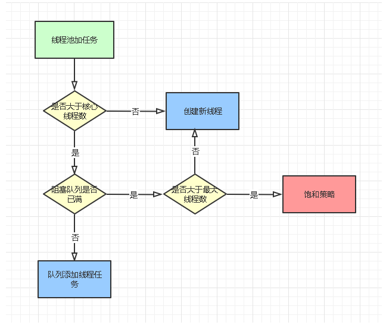
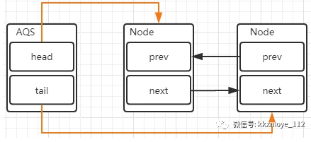
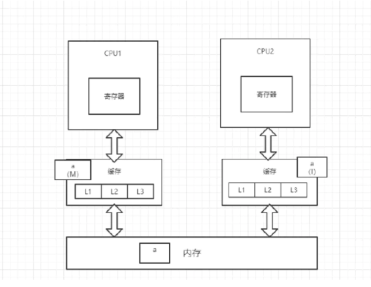
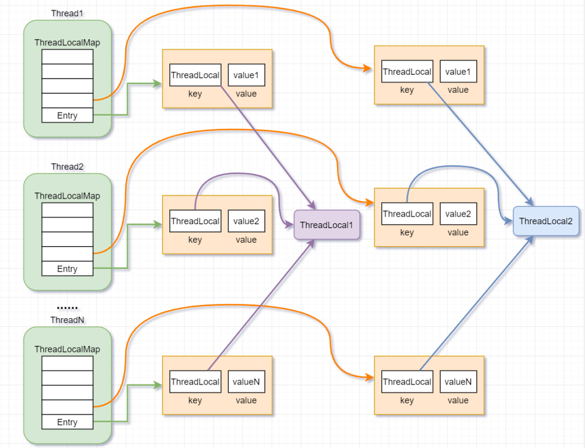

<h1>多线程</h1>


### 内存模型的三大特性
+ 原子性： Java 内存模型保证了 read、load、use、assign、store、write、lock 和 unlock 操作具有原子性，例如对一个 int 类型的变量执行 assign 赋值操作，这个操作就是原子性的
+ 可见性：可见性指当一个线程修改了共享变量的值，其它线程能够立即得知这个修改。Java 内存模型是通过在变量修改后将新值同步回主内存，在变量读取前从主内存刷新变量值来实现可见性的。
   主要有三种实现可见性的方式：
     + volatile (可以保证可见性，并不保证原子性)
     + synchronized，对一个变量执行 unlock 操作之前，必须把变量值同步回主内存。
     + final，被 final 关键字修饰的字段在构造器中一旦初始化完成，并且没有发生 this 逃逸（其它线程通过 this 引用访问到初始化了一半的对象），那么其它线程就能看见 final 字段的值。
+ 有序性：
   在本线程内观察，所有操作都是有序的。在一个线程观察另一个线程，所有操作都是无序的，无序是因为发生了指令重排序。
   实现有序行的方式：
   + volatile 关键字通过添加内存屏障的方式来禁止指令重排，即重排序时不能把后面的指令放到内存屏障之前、
   + 也可以通过 synchronized 来保证有序性，它保证每个时刻只有一个线程执行同步代码，相当于是让线程顺序执行同步代码

### 线程的五种基本状态
+ 1.新建状态（New）：当线程对象对创建后，即进入了新建状态，如：Thread t = new MyThread(); 
+ 2.就绪状态（Runnable）：当调用线程对象的start()方法，线程即进入就绪状态。处于就绪状态的线程，只是说明此线程已经做好了准备，随时等待CPU调度执行，并不是说执行了t.start()此线程立即就会执行；
+ 3.运行状态（Running）：当CPU开始调度处于就绪状态的线程时，此时线程才得以真正执行，即进入到运行状态。注：就 绪状态是进入到运行状态的唯一入口，也就是说，线程要想进入运行状态执行，首先必须处于就绪状态中； 
+ 4.阻塞状态（Blocked）：处于运行状态中的线程由于某种原因，暂时放弃对CPU的使用权，停止执行，此时进入阻塞状态，直到其进入到就绪状态，才有机会再次被CPU调用以进入到运行状态。根据阻塞产生的原因不同，阻塞状态又可以分为三种：
  +  等待阻塞：运行状态中的线程执行wait()方法，使本线程进入到等待阻塞状态；
  +  同步阻塞 — 线程在获取synchronized同步锁失败(因为锁被其它线程所占用)，它会进入同步阻塞状态；
  +  其他阻塞 — 通过调用线程的sleep()或join()或发出了I/O请求时，线程会进入到阻塞状态。当sleep()状态超时. join()等待线程终止或者超时. 或者I/O处理完毕时，线程重新转入就绪状态。
+ 5.死亡状态（Dead）：线程执行完了或者因异常退出了run()方法，该线程结束生命周期。

### 什么是线程死锁，死锁的四个必要条件
> 死锁： 多个线程同时被阻塞，它们中的一个或者全部都在等待某个资源被释放。由于线程被无限期地阻塞，因此程序不可能正常终止

死锁必须具备以下四个条件：
+ 互斥条件：该资源任意一个时刻只由一个线程占用
+ 请求与保持条件：一个进程因请求资源而阻塞时，对已获得的资源保持不放。
+ 不剥夺条件:线程已获得的资源在末使用完之前不能被其他线程强行剥夺，只有自己使用完毕后才释放资源
+ 循环等待条件:若干进程之间形成一种头尾相接的循环等待资源关系。

### 线程的三种创建方式
常说的是有三种创建线程的方式,但是一般都直接使用：
+ 1.实现Runnable 接口
```
public class MyRunnable implements Runnable {
    @Override
    public void run() {
        // ...
    }
}

public static void main(String[] args) {
    MyRunnable instance = new MyRunnable();
    Thread thread = new Thread(instance);
    thread.start();
}
```
+ 2.实现 Callable 接口
```
public class MyCallable implements Callable<Integer> {
    public Integer call() {
        return 123;
    }
}

public static void main(String[] args) throws ExecutionException, InterruptedException {
    MyCallable mc = new MyCallable();
    FutureTask<Integer> ft = new FutureTask<>(mc);
    Thread thread = new Thread(ft);
    thread.start();
    System.out.println(ft.get());
}
```
+ 3.继承Thread类
```
public class MyThread extends Thread {
    public void run() {
        // ...
    }
}

public static void main(String[] args) {
    MyThread mt = new MyThread();
    mt.start();
}
```
### java线程池
> 说明：使用线程就要注意cpu和内存的使用和释放，一般推荐是用线程池的方式来使用线程

线程池核心类-ThreadPoolExecutor,ThreadPoolExecutor含有如下七个参数
+ corePoolSize：核心线程数量
+ maximumPoolSize：线程最大线程数
+ workQueue：阻塞队列
   + 直接切换（SynchronusQueue）
   + 无界队列（LinkedBlockingQueue）能够创建的最大线程数为corePoolSize,这时maximumPoolSize就不会起作用了。当线程池中所有的核心线程都是运行状态的时候，新的任务提交就会放入等待队列中
   + 有界队列（ArrayBlockingQueue）最大maximumPoolSize，能够降低资源消耗，但是这种方式使得线程池对线程调度变的更困难。因为线程池与队列容量都是有限的。所以想让线程池的吞吐率和处理任务达到一个合理的范围，又想使我们的线程调度相对简单，并且还尽可能降低资源的消耗，我们就需要合理的限制这两个数量
+ keepAliveTime：线程没有任务执行时最多保持多久时间终止（当线程中的线程数量大于corePoolSize的时候，如果这时没有新的任务提交核心线程外的线程不会立即销毁，而是等待，直到超过keepAliveTime）
+ unit：keepAliveTime的时间单位
+ threadFactory：线程工厂，用来创建线程，有一个默认的工场来创建线程，这样新创建出来的线程有相同的优先级，是非守护线程、设置好了名称）
+ rejectHandler：当拒绝处理任务时(阻塞队列满)的策略（AbortPolicy默认策略直接抛出异常、CallerRunsPolicy用调用者所在的线程执行任务、DiscardOldestPolicy丢弃队列中最靠前的任务并执行当前任务、DiscardPolicy直接丢弃当前任务）

当调用线程池execute() 方法添加一个任务时，线程池会做如下判断：
+ 如果有空闲线程，则直接执行该任务；
+ 如果没有空闲线程，且当前运行的线程数少于corePoolSize，则创建新的线程执行该任务；
+ 如果没有空闲线程，且当前的线程数等于corePoolSize，同时阻塞队列未满，则将任务入队列，而不添加新的线程；
+ 如果没有空闲线程，且阻塞队列已满，同时池中的线程数小于maximumPoolSize ，则创建新的线程执行任务；
+ 如果没有空闲线程，且阻塞队列已满，同时池中的线程数等于maximumPoolSize ，则根据构造函数中的 handler 指定的策略来拒绝新的任务。


##### Executors类创建了四种线程池。但是阿里代码规范手册明确不推荐使用
+ Executors.newCachedThreadPool
  + newCachedThreadPool是一个根据需要创建新线程的线程池，当一个任务提交时，corePoolSize为0不创建核心线程，SynchronousQueue是一个不存储元素的队列，可以理解为队里永远是满的，因此最终会创建非核心线程来执行任务。
    对于非核心线程空闲60s时将被回收。因为Integer.MAX_VALUE非常大，可以认为是可以无限创建线程的.由于大量线程同时运行，很有会造成系统OOM
+ Executors.newSingleThreadExecutor
  + newSingleThreadExecutor是单线程线程池，只有一个核心线程，用唯一的一个共用线程执行任务，保证所有任务按指定顺序执行（FIFO、优先级…）
+ Executors.newFixedThreadPool
  + 定长线程池，核心线程数和最大线程数由用户传入，可以设置线程的最大并发数，超出在队列等待
+ Executors.newScheduledThreadPool
  + 定长线程池，核心线程数由用户传入，支持定时和周期任务执行


### 线程之间的协作
##### 1.join
>在线程中调用另一个线程的 join() 方法，会将当前线程挂起，而不是忙等待，直到目标线程结束,再执行
```
//虽然 b 线程先启动，但是因为在 b 线程中调用了 a 线程的 join() 方法，b 线程会等待 a 线程结束才继续执行，
//因此最后能够保证 a 线程的输出先于 b 线程的输出
public class JoinExample {

    private class A extends Thread {
        @Override
        public void run() {
            System.out.println("A");
        }
    }

    private class B extends Thread {

        private A a;

        B(A a) {
            this.a = a;
        }

        @Override
        public void run() {
            try {
                a.join();
            } catch (InterruptedException e) {
                e.printStackTrace();
            }
            System.out.println("B");
        }
    }

    public void test() {
        A a = new A();
        B b = new B(a);
        b.start();
        a.start();
    }
}

public static void main(String[] args) {
    JoinExample example = new JoinExample();
    example.test();
}
```  

##### 2.wait() notify() notifyAll()
> 调用 wait() 使得线程等待某个条件满足，线程在等待时会被挂起，当其他线程的运行使得这个条件满足时，其它线程会调用 notify() 或者 notifyAll() 来唤醒挂起的线程。
它们都属于 Object 的一部分，而不属于 Thread。
只能用在同步方法或者同步控制块中使用，否则会在运行时抛出 IllegalMonitorStateException。
使用 wait() 挂起期间，线程会释放锁。这是因为，如果没有释放锁，那么其它线程就无法进入对象的同步方法或者同步控制块中，那么就无法执行 notify() 或者 notifyAll() 来唤醒挂起的线程，造成死锁。
```
public class WaitNotifyExample {

    public synchronized void before() {
        System.out.println("before");
        notifyAll();
    }

    public synchronized void after() {
        try {
            wait();
        } catch (InterruptedException e) {
            e.printStackTrace();
        }
        System.out.println("after");
    }
}

public static void main(String[] args) {
    ExecutorService executorService = Executors.newCachedThreadPool();
    WaitNotifyExample example = new WaitNotifyExample();
    executorService.execute(() -> example.after());
    executorService.execute(() -> example.before());
}
```
##### 3.await() signal() signalAll()
>java.util.concurrent 类库中提供了 Condition 类来实现线程之间的协调，可以在 Condition 上调用 await() 方法使线程等待，其它线程调用 signal() 或 signalAll() 方法唤醒等待的线程。
相比于 wait() 这种等待方式，await() 可以指定等待的条件，因此更加灵活。
使用 Lock 来获取一个 Condition 对象。
```
public class AwaitSignalExample {

    private Lock lock = new ReentrantLock();
    private Condition condition = lock.newCondition();

    public void before() {
        lock.lock();
        try {
            System.out.println("before");
            condition.signalAll();
        } finally {
            lock.unlock();
        }
    }

    public void after() {
        lock.lock();
        try {
            condition.await();
            System.out.println("after");
        } catch (InterruptedException e) {
            e.printStackTrace();
        } finally {
            lock.unlock();
        }
    }
}

public static void main(String[] args) {
    ExecutorService executorService = Executors.newCachedThreadPool();
    AwaitSignalExample example = new AwaitSignalExample();
    executorService.execute(() -> example.after());
    executorService.execute(() -> example.before());
}
```

### sleep() 方法和 wait() 方法区别和共同点?
##### 区别
+ sleep方法：是Thread类的静态方法，当前线程将睡眠n毫秒，线程进入阻塞状态。当睡眠时间到了，会解除阻塞，进入可运行状态，等待CPU的到来。睡眠不释放锁（如果有的话）。
+ wait方法：是Object的方法，必须与synchronized关键字一起使用，线程进入阻塞状态，当notify或者notifyall被调用后，会解除阻塞。但是，只有重新占用互斥锁之后才会进入可运行状态。睡眠时，会释放互斥锁。
+ sleep 方法没有释放锁，而 wait 方法释放了锁 。
+ sleep 通常被用于暂停执行Wait 通常被用于线程间交互/通信
+ sleep() 方法执行完成后，线程会自动苏醒。或者可以使用 wait(long timeout)超时后线程会自动苏醒。wait() 方法被调用后，线程不会自动苏醒，需要别的线程调用同一个对象上的 notify() 或者 notifyAll() 方法
##### 相同
+ 两者都可以暂停线程的执行。

### CAS
+ 乐观锁需要操作和冲突检测这两个步骤具备原子性，这里就不能再使用互斥同步来保证了，只能靠硬件来完成。硬件支持的原子性操作最典型的是：比较并交换（Compare-and-Swap，CAS）。CAS 指令需要有 3 个操作数，分别是内存地址 V、旧的预期值 A 和新值 B。当执行操作时，只有当 V 的值等于 A，才将 V 的值更新为 B
#####存在的缺陷
+ ABA问题
  >并发环境下，假设初始条件是A，去修改数据时，发现是A就会执行修改。但是看到的虽然是A，中间可能发生了A变B，B又变回A的情况。此时A已经非彼A，数据即使成功修改，也可能有问题。
  可以通过AtomicStampedReference解决ABA问题，它，一个带有标记的原子引用类，通过控制变量值的版本来保证CAS的正确性。
+ 循环时间长开销
  > 自旋CAS，如果一直循环执行，一直不成功，会给CPU带来非常大的执行开销。
    很多时候，CAS思想体现，是有个自旋次数的，就是为了避开这个耗时问题~
+ 只能保证一个变量的原子操作。
  > CAS 保证的是对一个变量执行操作的原子性，如果对多个变量操作时，CAS 目前无法直接保证操作的原子性的
##### 可以通过这两个方式解决这个问题：
+ 使用互斥锁来保证原子性；        
+ 将多个变量封装成对象，通过AtomicReference来保证原子性。


### synchronized的原理和作用
原理：
>synchronized 同步代码块的实现是通过 monitorenter 和 monitorexit 指令，其中 monitorenter 指令指向同步代码块的开始位置，monitorexit 指令则指明同步代码块的结束位置。当执行 monitorenter 指令时，线程试图获取锁也就是获取 monitor(monitor对象存在于每个Java对象的对象头中，synchronized 锁便是通过这种方式获取锁的，也是为什么Java中任意对象可以作为锁的原因) 的持有权。
 其内部包含一个计数器，当计数器为0则可以成功获取，获取后将锁计数器设为1也就是加1。相应的在执行 monitorexit 指令后，将锁计数器设为0，表明锁被释放。如果获取对象锁失败，那当前线程就要阻塞等待，直到锁被另外一个线程释放为止
 synchronized 修饰的方法并没有 monitorenter 指令和 monitorexit 指令，取得代之的确实是 ACC_SYNCHRONIZED 标识，该标识指明了该方法是一个同步方法，JVM 通过该 ACC_SYNCHRONIZED 访问标志来辨别一个方法是否声明为同步方法，从而执行相应的同步调用。

作用：
+ 原子性：确保线程互斥的访问同步代码；
+ 可见性：保证共享变量的修改能够及时可见，其实是通过Java内存模型中的 “对一个变量unlock操作之前，必须要同步到主内存中；如果对一个变量进行lock操作，则将会清空工作内存中此变量的值，在执行引擎使用此变量前，需要重新从主内存中load操作或assign操作初始化变量值” 来保证的；
+ 有序性：有效解决重排序问题，即 “一个unlock操作先行发生(happen-before)于后面对同一个锁的lock操作”
> synchronized 解决的是执行控制的问题，它会阻止其他线程获取当前对象的监控锁，这样一来就让当前对象中被 synchronized 关键字保护的代码块无法被其他线程访问，也就是无法并发执行。而且，synchronized 还会创建一个 内存屏障，内存屏障指令保证了所有 CPU 操作结果都会直接刷到主存中，从而 保证操作的内存可见性，同时也使得这个锁的线程的所有操作都 happens-before 于随后获得这个锁的线程的操作。

### synchronized锁升级的过程
无锁->偏向锁->自旋->重量级锁
过程
>一开始是无锁状态，在锁对象的对象头里面有一个 threadid 字段，在第一次访问之前threadid 为空，jvm 让其持有偏向锁，并将 threadid 设置为其线程 id，再次进入的时候会先判断 threadid 是否与其线程 id 一致，如果一致则可以直接使用此对象，如果不一致，则升级偏向锁为轻量级锁，通过自旋循环一定次数来获取锁，执行15次之后，如果还没有正常获取到要使用的对象，此时就会把锁从轻量级升级为重量级锁，此过程就构成了 synchronized 锁的升级

目的：锁升级是为了减低了锁带来的性能消耗。在 Java 6 之后优化 synchronized 的实现方式，使用了偏向锁升级为轻量级锁再升级到重量级锁的方式，从而减低了锁带来的性能消耗。

### synchronized锁消除
锁消除主要是通过逃逸分析来支持，如果堆上的共享数据不可能逃逸出去被其它线程访问到，那么就可以把它们当成私有数据对待，也就可以将它们的锁进行消除。

### synchronized锁粗化
如果一系列的连续操作都对同一个对象反复加锁和解锁，频繁的加锁操作就会导致性能损耗。
如果虚拟机探测到由这样的一串零碎的操作都对同一个对象加锁，将会把加锁的范围扩展（粗化）到整个操作序列的外部


### ReentrantLock的原理和作用
说明：
ReentrantLock是可重入的互斥锁，虽然具有与synchronized相同功能，但是会比synchronized更加灵活
ReentrantLock底层基于AQS(AbstractQueuedSynchronizer)实现
使用
```
public class LockExample {

    private Lock lock = new ReentrantLock();

    public void func() {
        lock.lock();
        try {
            for (int i = 0; i < 10; i++) {
                System.out.print(i + " ");
            }
        } finally {
            lock.unlock(); // 确保释放锁，从而避免发生死锁。
        }
    }
}
public static void main(String[] args) {
    LockExample lockExample = new LockExample();
    ExecutorService executorService = Executors.newCachedThreadPool();
    executorService.execute(() -> lockExample.func());
    executorService.execute(() -> lockExample.func());
}
```

### AQS(AbstractQueuedSynchronizer)

AQS 是一个锁框架，它定义了锁的实现机制，并开放出扩展的地方，让子类去实现，比如我们在 lock 的时候，AQS 开放出 state 字段，让子类可以根据 state 字段来决定是否能够获得锁，对于获取不到锁的线程 AQS 会自动进行管理，无需子类锁关心，这就是 lock 时锁的内部机制，封装的很好，又暴露出子类锁需要扩展的地方；
AQS 底层是由同步队列 + 条件队列联手组成，同步队列管理着获取不到锁的线程的排队和释放，条件队列是在一定场景下，对同步队列的补充，比如获得锁的线程从空队列中拿数据，肯定是拿不到数据的，这时候条件队列就会管理该线程，使该线程阻塞；

AQS提供了一种实现阻塞锁和一系列依赖FIFO等待队列的同步器的框架.
1.核心思想：
如果被请求的共享资源空闲，则将当前请求资源的线程设置为有效的工作线程，并且将共享资源设置为锁定状态。如果被请求的共享资源被占用，那么就需要一套线程阻塞等待以及被唤醒 时锁分配的机制，这个机制 AQS 是用 CLH 队列锁实现的，即将暂时获取不到锁的线程加入到队列中。
2.实现：
AQS的实现依赖内部的同步队列,也就是FIFO的双向队列，如果当前线程竞争锁失败，那么AQS会把当前线程以及等待状态信息构造成一个Node加入到同步队列中，
同时再阻塞该线程。当获取锁的线程释放锁以后，会从队列中唤醒一个阻塞的节点(线程)。


### ReentrantLock与synchronized的区别
1. 锁的实现:
synchronized是通过JVM实现的，而ReentrantLock是通过JDK实现的(需要 lock() 和 unlock() 方法配合 try/finally 语句块来完成)。
2. 性能:
新版本 Java 对 synchronized 进行了很多优化，例如自旋锁等，synchronized 与 ReentrantLock 大致相同。
3. 等待可中断:
当持有锁的线程长期不释放锁的时候，正在等待的线程可以选择放弃等待，改为处理其他事情。
ReentrantLock 可中断，而 synchronized 不行。
4. 公平锁:
公平锁是指多个线程在等待同一个锁时，必须按照申请锁的时间顺序来依次获得锁。
synchronized 中的锁是非公平的，ReentrantLock 默认情况下也是非公平的，但是也可以是公平的。
5. 锁绑定多个条件:
一个 ReentrantLock 可以同时绑定多个 Condition 对象。


### volatile的原理和作用
存在问题说明：
实例化一个对象其实可以分为三个步骤：
1.分配内存空间。2.初始化对象。3.将内存空间的地址赋值给对应的引用。
但是由于操作系统可以对指令进行重排序打乱顺序。

+ 避免指令重排序
> 获取JIT（即时Java编译器，把字节码解释为机器语言发送给处理器）的汇编代码，发现volatile多加了lock addl指令，这个操作相当于一个内存屏障，使得lock指令后的指令不能重排序到内存屏障前的位置

存在问题说明：
可见性问题主要指一个线程修改了共享变量值，而另一个线程却看不到。引起可见性问题的主要原因是每个线程拥有自己的一个高速缓存区——线程工作内存。
+ 保证线程变量的可见性。MESI（缓存一致性协议）
> 利用缓存块（64个字节）对齐，当一个线程中的变量更换后，必须要同步到主内存中；如果对一个变量进行lock操作，则将会清空工作内存中此变量的值


### synchronized与volatile的区别
+ 1.volatile 本质是在告诉 JVM 当前变量在寄存器（工作内存）中的值是不确定的，需要从主存中读取； synchronized 则是锁定当前变量，只有当前线程可以访问该变量，其他线程被阻塞住。
+ 2.volatile 仅能使用在变量级别；synchronized 则可以使用在变量、方法和类级别的
+ 3.volatile 仅能实现变量的修改可见性，不能保证原子性；而synchronized 则可以保证变量的修改可见性和原子性
+ 4.volatile 不会造成线程的阻塞；synchronized 可能会造成线程的阻塞。
+ 5.volatile 标记的变量不会被编译器优化；synchronized 标记的变量可以被编译器优化。

### ThreadLocal介绍和原理
1.说明：
ThreadLocal，即线程本地变量。如果你创建了一个ThreadLocal变量，那么访问这个变量的每个线程都会有这个变量的一个本地拷贝，多个线程操作这个变量的时候，实际是操作自己本地内存里面的变量，从而起到线程隔离的作用，避免了线程安全问题。
```
static ThreadLocal<String> localVariable = new ThreadLocal<>();
```
原理：
+ Thread类有一个类型为ThreadLocal.ThreadLocalMap的实例变量threadLocals，即每个线程都有一个属于自己的ThreadLocalMap。
+ ThreadLocalMap内部维护着Entry数组，每个Entry代表一个完整的对象，key是ThreadLocal本身，value是ThreadLocal的泛型值。
+ 每个线程在往ThreadLocal里设置值的时候，都是往自己的ThreadLocalMap里存，读也是以某个ThreadLocal作为引用，在自己的map里找对应的key，从而实现了线程隔离

特别注意ThreadLocal内存泄漏问题:
>ThreadLocalMap中使用的 key 为 ThreadLocal 的弱引用（只要垃圾回收机制一运行，不管JVM的内存空间是否充足，都会回收该对象占用的内存。）
弱引用比较容易被回收。因此，如果ThreadLocal（ThreadLocalMap的Key）被垃圾回收器回收了，但是因为ThreadLocalMap生命周期和Thread是一样的，它这时候如果不被回收，就会出现这种情况：ThreadLocalMap的key没了，value还在，这就会造成了内存泄漏问题。

处理办法：
使用完ThreadLocal后，及时调用remove()方法释放内存空间。


### CyclicBarrier 和 CountDownLatch 的区别
+ CountDownLatch 简单的说就是一个线程等待，直到他所等待的其他线程都执行完成并
    且调用 countDown()方法发出通知后，当前线程才可以继续执行。
+ cyclicBarrier 是所有线程都进行等待，直到所有线程都准备好进入 await()方法之后，
    所有线程同时开始执行！
+ CountDownLatch 的计数器只能使用一次。而 CyclicBarrier 的计数器可以使用 reset()
    方法重置。所以 CyclicBarrier 能处理更为复杂的业务场景，比如如果计算发生错误，可以
    重置计数器，并让线程们重新执行一次。
+ CyclicBarrier 还提 供其他有 用的方法 ，比如 getNumberWaiting 方法 可以获得
    CyclicBarrier 阻塞的线程数量。isBroken 方法用来知道阻塞的线程是否被中断。如果被中断
    返回 true，否则返回 false。

### Semaphore
+ Semaphore 类似于操作系统中的信号量，可以控制对互斥资源的访问线程数。
Semaphore(信号量)可以指定多个线程同时访问某个资源。

### Atomic 原子类
Atomic 是指一个操作是不可中断的。即使是在多个线程一起执行的时候，一个操作一旦开始，就不会被其他线程干扰。所以，所谓原子类说简单点就是具有原子 / 原子操作特征的类。

#####AtomicInteger
AtomicInteger 类主要利用 CAS和 volatile 和 native 方法来保证原子操作，从而避免 synchronized 的高开销，执行效率大为提

<hr>